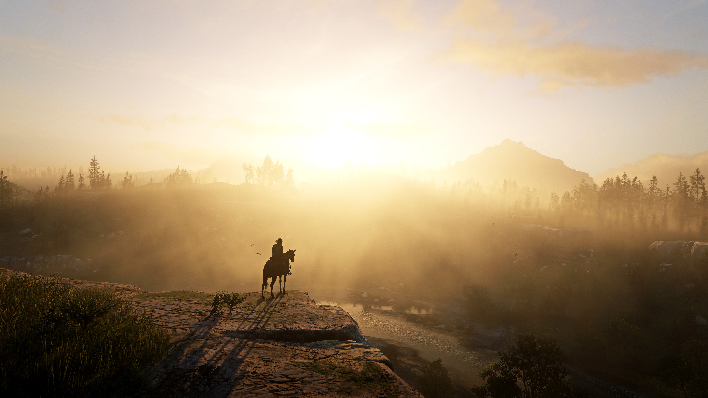

# 🎮 Red Dead Redemption - Página Oficial (Fan Project)

Este é um projeto de site estático inspirado no jogo **Red Dead Redemption**, criado com HTML, CSS e JavaScript. Ele possui uma interface estilizada e um botão interativo que exibe o trailer do jogo ao passar o mouse.


---

## 📷 Prévia



---

## 🔧 Tecnologias Utilizadas

- HTML5
- CSS3
- JavaScript (puro)
- Git & GitHub
- GitHub Pages (deploy)

---

## 🧠 Funcionalidades

- Página responsiva
- Estilo inspirado no universo Red Dead
- Efeito interativo de hover no botão "Assista o Trailer"
- Trailer embutido como background com transição suave
- Navegação entre páginas (Home, Sobre, Mídia, Comprar)

---

## 🚀 Como rodar localmente

1. Clone o repositório:
   ```bash
   git clone https://github.com/AlexBruno099/Project-Red-Dead.git
